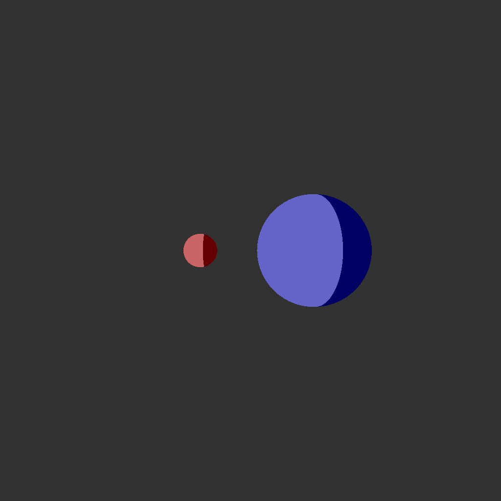

# A very crude implementataion of RayTracing in Python
I literally have no idea what I am doing. I just hit my keyboard until something works :)
   
The idea is to (eventually) use the numba library to execute most of the code from the gpu. That way I can hide my bad coding abilities with the power ___of parallel computing___.
   
This is what I have for now (2022-02-28):
 
  

Also, I am using/used this:  
https://tavianator.com/index.html  
https://www.scratchapixel.com/index.php  
http://lousodrome.net/blog/light/2020/07/03/intersection-of-a-ray-and-a-plane/
https://www.cs.cornell.edu/courses/cs4620/2017sp/slides/05rt-shading.pdf
